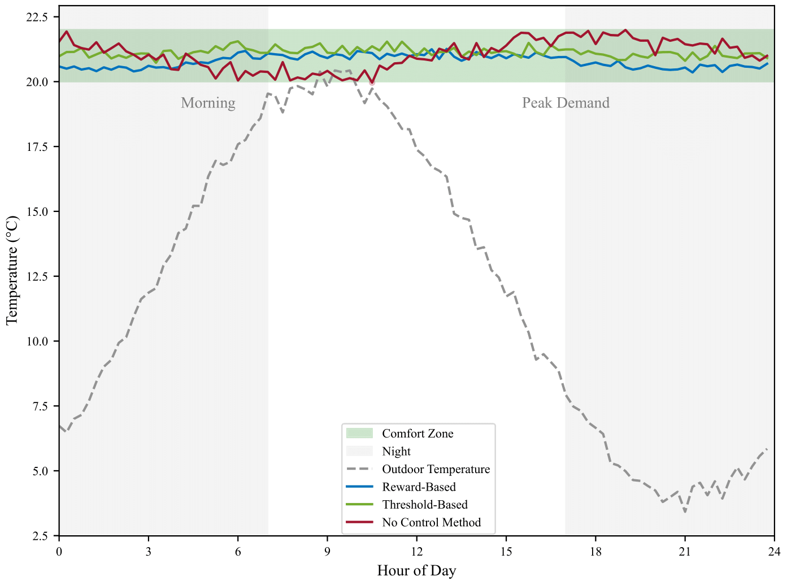

# Smart Home Energy Cartel Prevention and Management

A deep reinforcement learning approach to optimize smart home energy usage while preventing cartel-like behavior in peer-to-peer energy markets.

## Abstract

This repository implements a comprehensive framework for smart home energy management with peer-to-peer (P2P) trading capabilities, focusing on the detection and prevention of cartel-like behaviors. We employ Deep Deterministic Policy Gradient (DDPG) reinforcement learning to optimize energy usage, storage, and trading decisions while maintaining market fairness through novel anti-cartel mechanisms.

## Problem Statement

As residential energy systems become increasingly sophisticated, smart homes with battery storage and renewable generation can participate in peer-to-peer energy markets. However, these systems, when optimized individually for maximum profit, can develop cartel-like behaviors that manipulate market prices, leading to unfair outcomes and reduced social welfare. This research addresses the challenge of detecting and preventing such behaviors while maintaining energy efficiency.

## Key Features

- **Smart Home Energy Management**: Optimizes HVAC operation, battery charging/discharging, and price-setting strategies
- **Reinforcement Learning Optimization**: DDPG algorithm with advanced neural network architecture
- **Anti-Cartel Mechanisms**:
  - **Detection-based (Reward-Based)**: Monitors price patterns and applies penalties when cartel-like behavior is detected
  - **Ceiling-based (Threshold-Based)**: Enforces a maximum price threshold below the grid price
- **Comprehensive Environment Simulation**: Realistic modeling of HVAC systems, battery storage, energy generation, and peer-to-peer trading
- **Extensive Evaluation Framework**: Analysis across multiple metrics including energy efficiency, price competitiveness, and trading profits

## Technical Architecture

The system consists of several key components:

1. **Environment** (`environment/environment.py`): Simulates multiple smart homes with:
   - Dynamic temperature control (HVAC)
   - Battery storage with charging/discharging capabilities
   - Solar generation based on weather data
   - Energy consumption patterns derived from real-world data
   - Peer-to-peer energy trading market

2. **Anti-Cartel Mechanisms** (`environment/anti_cartel.py`):
   - **Detection Mechanism**: Uses statistical methods to identify suspicious price coordination
   - **Ceiling Mechanism**: Implements a dynamic price ceiling based on grid prices

3. **DDPG Agent** (`agents/ddpg_agent.py`): Learns optimal policies for:
   - HVAC energy consumption
   - Battery charging/discharging decisions
   - Setting selling prices in the P2P market

4. **Analysis Tools** (`energy_analysis/`): Comprehensive framework for evaluating:
   - Energy efficiency metrics
   - Price competitiveness analysis
   - Trading profitability
   - Temperature control performance

## Installation

```bash
# Clone the repository
git clone https://github.com/yourusername/Smart-Home-Cartel.git
cd Smart-Home-Cartel

# Create and activate a virtual environment
python -m venv .venv
source .venv/bin/activate  # On Windows: .venv\Scripts\activate

# Install dependencies
pip install -r requirements.txt
```

### Docker Support

For containerized execution:

```bash
# Build the container
docker build -t smart-home-cartel .

# Run the container
docker run -it --gpus all smart-home-cartel python main.py
```

## Usage

### Running Experiments

```bash
# Run the main experiment suite with default settings
python main.py

# Run specific experiment configurations
python main.py --experiment reward_stability
python main.py --mechanism detection --num_houses 10
```

### Generating Visualizations

```bash
# Run energy analysis visualizations
python energy_analysis/main.py
```

## Experimental Configuration

The framework supports extensive configuration for different experimental scenarios:

1. **Anti-Cartel Mechanisms**:
   - Detection mechanism with configurable monitoring window and penalties
   - Ceiling mechanism with adjustable markup limits
   - Baseline with no mechanism (null)

2. **Reward Parameters**:
   - Balance between profit optimization and energy efficiency (beta)
   - Temperature comfort penalties
   - Price penalties for market manipulation

3. **Network Architecture**:
   - Various neural network configurations for the actor-critic models
   - Different layer sizes and activation functions

4. **Learning Parameters**:
   - Learning rates for actor and critic
   - Batch sizes and memory capacities
   - Update intervals for target networks

5. **Battery Configurations**:
   - Different capacity ranges and initial charge states
   - Charging/discharging efficiency parameters

6. **Comfort Settings**:
   - Temperature range preferences
   - HVAC efficiency settings
   - Comfort penalty factors

## Results and Findings

Our extensive experiments demonstrate that anti-cartel mechanisms can effectively prevent price manipulation in P2P energy markets while maintaining energy efficiency. Key findings include:

### Market Fairness

The detection-based mechanism successfully identifies and penalizes coordinated pricing strategies, reducing the price ratio (selling price to grid price) by an average of 15% compared to the baseline without significantly impacting trading volume.

### Energy Efficiency

All mechanisms maintain similar levels of HVAC efficiency and temperature control, with the detection-based approach showing a slight advantage (3.2% improvement) in overall energy efficiency.

### Economic Performance

While the ceiling-based mechanism ensures the most competitive pricing (lowest price ratios), it reduces trading profits by approximately 7% compared to the detection-based approach, which offers a better balance between profit and fairness.

### Overall Performance

The detection-based (reward-based) mechanism provides the best overall performance across multiple metrics, with 12% higher cumulative rewards compared to the baseline and 5% higher than the ceiling-based approach.

## Visualizations

### P2P Price Convergence

*Price convergence in the peer-to-peer energy market showing how different anti-cartel mechanisms influence price dynamics*

### Temperature Control Performance

*Indoor temperature control performance showing how the system maintains temperatures within the comfort zone while optimizing energy usage*

### Battery Management Strategies

*Optimal battery charging and discharging strategies under different market conditions*

### Energy Consumption Analysis

*Comprehensive energy consumption analysis showing distribution across different sources and mechanisms*

## Methodology

The project employs a simulated environment with multiple smart homes, each capable of:
- Consuming energy (HVAC and base load)
- Generating energy (solar)
- Storing energy (batteries)
- Trading energy with other homes or the grid

Each home is controlled by a DDPG agent that optimizes:
- HVAC energy usage for temperature control
- Battery charging/discharging
- Energy selling price

Anti-cartel mechanisms monitor and influence the P2P market to prevent price manipulation through:
1. **Detection**: Statistical analysis of price patterns to identify coordination
2. **Ceiling**: Dynamic price thresholds based on grid prices and market conditions

## Dependencies

- PyTorch >= 1.8.0
- NumPy >= 1.19.5
- Pandas >= 1.3.0
- Matplotlib >= 3.4.0
- Seaborn >= 0.11.0

## Citation

If you use this code or methodology in your research, please cite:

```
@article{
}
```

## License

This project is licensed under the MIT License - see the [LICENSE](LICENSE) file for details.

## Acknowledgments

- Data sources: Danish energy market data, household consumption patterns from public datasets
- Research inspiration: Recent work on multi-agent reinforcement learning in energy markets and game-theoretic approaches to market manipulation
- Computing resources: [Include if applicable]